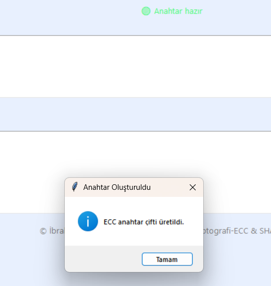
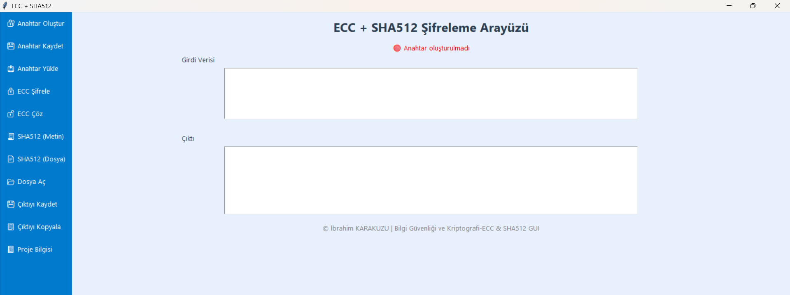
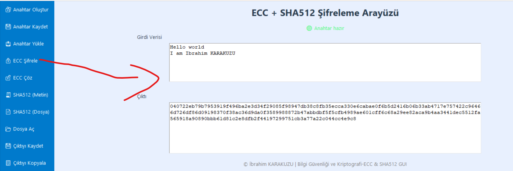
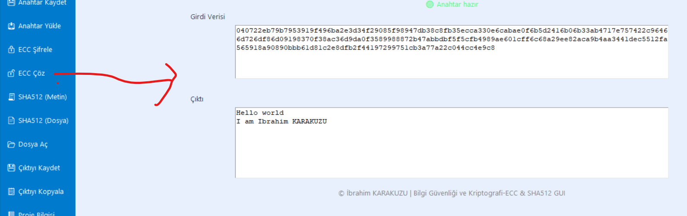

# 🔐 ECC + SHA512 Şifreleme Uygulaması (Python GUI)

Bu proje, **Eliptik Eğri Kriptografisi (ECC)** ve **SHA512 özetleme algoritmasını** kullanan bir masaüstü uygulamasıdır. Uygulama, kullanıcı dostu bir arayüz (GUI) aracılığıyla metinlerin veya dosyaların güvenliğini sağlamaya yönelik şifreleme, çözme ve özetleme işlemlerini gerçekleştirir.

---

## 🎯 Amaç

Bu uygulamanın amacı, ECC ile veri şifreleme/çözme ve SHA512 ile veri özetleme işlemlerini görsel bir arayüz üzerinden kullanıcıya sunmaktır. Proje, kriptografi tekniklerinin pratikte nasıl kullanılabileceğini göstermek üzere geliştirilmiştir.

---

## ⚙️ Özellikler

- ✅ **ECC Anahtar Çifti Oluşturma**  
  Uygulama, ECC tabanlı bir özel/genel anahtar çifti üretir.

- ✅ **Anahtar Kaydetme/Yükleme**  
  Oluşturulan anahtarlar `.txt` dosyasına kaydedilebilir ve daha sonra tekrar yüklenebilir.

- ✅ **Metin Şifreleme (ECC)**  
  Girdi alanına yazılan metin, ECC algoritması kullanılarak şifrelenebilir.

- ✅ **Şifre Çözme (ECC)**  
  Şifrelenmiş veriler, özel anahtar kullanılarak çözülebilir.

- ✅ **SHA512 ile Özetleme (Metin ve Dosya)**  
  Girilen metnin veya seçilen bir dosyanın SHA512 özet değeri (hash) alınabilir.

- ✅ **Dosya Açma / Çıktı Kaydetme / Panoya Kopyalama**  
  Dosya sisteminden metin okunabilir, sonuçlar kaydedilebilir veya kopyalanabilir.

- ✅ **Açık Tema ve Sol Menü**  
  Modern bir kullanıcı arayüzü ile görsel kullanım kolaylığı sunar.

---

## 🖥️ Ekran Görüntüleri

### 🔴 Anahtar Oluşturulmadı


### 🟢 Anahtar Oluşturuldu


### 📂 Dosya Açma
_Dosya_Ac_click.png)

### 📝 Metin Girişi


### 🔒 ECC Şifreleme


### 🔓 ECC Şifre Çözme


---

## 🚀 Kurulum ve Kullanım

### 1. Gerekli Kütüphaneler

Uygulama Python ile yazılmıştır. Aşağıdaki kütüphanelerin kurulu olması gerekir:

```bash
pip install eciespy
```

> Not: `tkinter` kütüphanesi Python ile birlikte gelir. Eğer kurulu değilse:
> - **Ubuntu/Linux:** `sudo apt install python3-tk`
> - **Windows:** Python kurulumu sırasında `tcl/tk` seçeneği işaretli olmalıdır.

---

### 2. Uygulamayı Başlatma

```bash
python main.py
```

---

## 📁 Proje Dosya Yapısı

```
crypto_project/
│
├── ecc_gui.py                # Uygulamanın ana Python dosyası
├── readme.md              # Projeyi açıklayan bu dosya
└── screenshots/           # Ekran görüntülerinin yer aldığı klasör
    ├── anahtar_olusturuldu.png
    ├── anahtar_olusturulmadi.png
    ├── SHA512(Dosya)_Dosya_Ac_click.png
    ├── giris.png
    ├── sifreleme.png
    └── cozme.png
```

---

## 📚 Kullanılan Teknolojiler

| Teknoloji  | Açıklama |
|------------|----------|
| Python     | Genel yazılım dili |
| tkinter    | GUI (grafik arayüz) kütüphanesi |
| eciespy    | ECC (Eliptik Eğri Kriptografisi) uygulaması |
| hashlib    | SHA512 özetleme için yerleşik Python modülü |

---

## 👨‍🎓 Proje Sahibi

Bu proje, **İbrahim KARAKUZU** tarafından **Bilgi Güvenliği ve Kriptografi** dersi kapsamında **Temmuz 2025** tarihinde geliştirilmiştir.


---

## 📎 Lisans

Bu proje sadece eğitim amaçlıdır. Herhangi bir gerçek dünyadaki güvenlik sisteminde doğrudan kullanılmadan önce detaylı denetim gerektirir.
